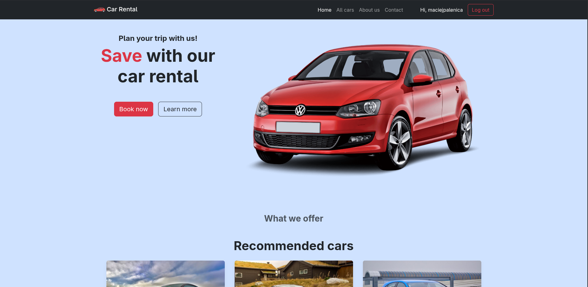
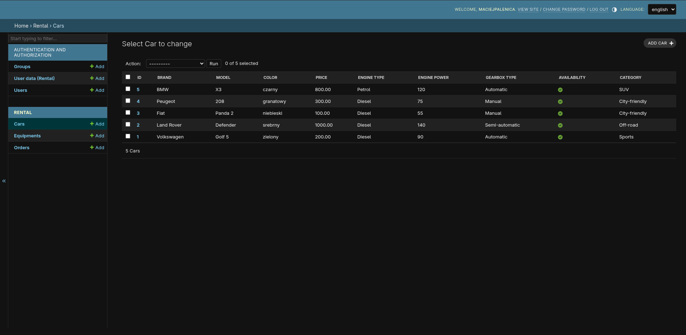

# CarRental - Car Rental Management System

A web application for managing a car rental business, built with Django with multi-language support (Polish/English).

## Project Description

CarRental is a comprehensive car rental management system that enables:
- Browse available cars by category
- Display detailed vehicle information
- Book cars for logged-in users
- Manage fleet and orders (admin panel)
- Recommendations and ranking of the most popular cars

## 📺 Visual Presentation

### User Experience

*View of the client-facing homepage and its modular design.*

#### User Experience & Fleet
<p align="center">
  
  
</p>

*Left: Comprehensive overview of the homepage, featuring personalized recommendations and popularity rankings.*

*Right: Complete fleet browser displaying all available vehicles by category.*


### Management Dashboard (Admin Panel)

*Internal system for administrators to manage fleet, add new vehicles, and configure equipment options.*

## Technologies

- **Backend**: Django 6.0.2
- **Frontend**: Jinja2 templates
- **Database**: SQLite (development)
- **Programming Language**: Python 3.14+
- **Additional Libraries**:
  - Pandas - for data processing
  - Pillow - for image management
  - NumPy - data operations

## Requirements

All dependencies are located in the `requirements.txt` file:

## 🔧 Installation

1. **Clone the repository**
```bash
git clone https://github.com/MacPal2002/CarRental.git
cd CarRental
```

2. **Create a virtual environment**
```bash
python -m venv venv
source venv/bin/activate  # Linux/Mac
# or
venv\Scripts\activate  # Windows
```

3. **Install dependencies**
```bash
pip install -r requirements.txt
```

4. **Navigate to the project directory**
```bash
cd carrental
```

5. **Run database migrations**
```bash
python manage.py makemigrations
python manage.py migrate
```

6. **Create a superuser (optional)**
```bash
python manage.py createsuperuser
```

7. **Run the development server**
```bash
python manage.py runserver
```

8. **Open your browser**
```
http://127.0.0.1:8000
```

## Project Structure

```
CarRental/
├── carrental/              # Main Django project directory
│   ├── carrental/          # Project configuration
│   │   ├── settings.py     # Django settings
│   │   ├── urls.py         # URL routing
│   │   └── wsgi.py         # WSGI config
│   ├── rental/             # Main application
│   │   ├── models.py       # Database models
│   │   ├── views.py        # Views and business logic
│   │   ├── forms.py        # Forms
│   │   └── admin.py        # Admin panel
│   ├── templates/          # HTML templates (Jinja2)
│   ├── media/              # Media files (car photos)
│   └── manage.py           # Django CLI tool
├── requirements.txt        # Project dependencies
└── README.md              # This file
```

## Features

### Data Models

#### Car
- **Categories**: SUV, City-friendly, Off-road, Van, Sports
- **Engine Types**: Petrol, Diesel, Hybrid, Electric, Hydrogen
- **Transmissions**: Automatic, Manual, Semi-automatic
- **Details**: Brand, model, number of seats/doors, engine power, fuel consumption, rental price, vehicle value

#### Equipment
- Multiple equipment assignment to cars

#### UserData
- Extended Django user model
- Reservation data handling

#### Order
- Reservation system with deposit handling (10% of vehicle value)
- Link to user and car

### Views

- **index** - Homepage with recommendations and most popular cars
- **cars** - List of all cars grouped by category
- **car** - Single vehicle details
- **rent** - Reservation form (requires login)

## Internationalization

The application supports two languages:
- 🇵🇱 Polish (default)
- 🇬🇧 English

## Security Notes

⚠️ **IMPORTANT**: Before deploying to production:
1. Change `SECRET_KEY` in `settings.py`
2. Set `DEBUG = False`
3. Configure `ALLOWED_HOSTS`
4. Use a more secure database (PostgreSQL/MySQL)
5. Configure proper permissions for media files

## Images

The project automatically scales uploaded car photos to 800px width while maintaining a 330.75:186.05 aspect ratio.

## License

Project created for educational purposes.
